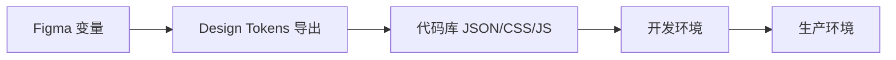

# Mobile 组件库 - 设计系统分析与语义命名规范

## 📋 组件库现状分析

### 现有结构

根据 Figma 文件分析，当前组件库包含以下内容：

#### 1. **全局样式 (Global Styles)**
- Typography（排版）
- Color（颜色）
- Radius（圆角）
- Spacing（间距）

#### 2. **组件分类**

**通用组件 (General)**
- StatusBars（状态栏）
- HomeIndicator（主屏幕指示条）
- Icon（图标）
- Keyboard（键盘）

**基础组件 (Foundation)**
- Button（按钮）
- Divider（分割线）
- Fab（悬浮按钮）
- Link（链接）

**导航组件 (Navigation)**
- Nav bar（顶部导航栏）
- Tab bar（底部标签栏）
- Drawer（抽屉）
- Tabs（选项卡）
- Index（索引）
- Sidebar（侧边栏）
- Steps（步骤条）
- Backtop（返回顶部）

**输入组件 (Input)**
- Search（搜索）
- Switch（开关）

**数据展示 (Data Display)**
- Badge（角标）
- Avatar（头像）
- Cell（列表单元格）

#### 3. **现有文字样式层级**
- Headline/H1, H2, H3（标题）
- Title/T1, T2, T3（标题）
- Body/Normal, Emphasis（正文）
- Caption/C1, C2, C3（说明文字）
- Interactive/ButtonLarge, ButtonSmall（交互按钮）

---

## 🎯 完整语义命名系统

### 1. 颜色系统 (Color Tokens)

#### 1.1 基础色板 (Primitive Colors)
```
// 品牌色
color.brand.primary.{100-900}
color.brand.secondary.{100-900}
color.brand.tertiary.{100-900}

// 中性色
color.neutral.{0-100}        // 白色到黑色，10%递增
color.neutral.alpha.{5-95}   // 半透明黑，5%递增

// 功能色
color.semantic.success.{100-900}
color.semantic.warning.{100-900}
color.semantic.error.{100-900}
color.semantic.info.{100-900}

// 扩展色（可选）
color.extended.red.{100-900}
color.extended.orange.{100-900}
color.extended.yellow.{100-900}
color.extended.green.{100-900}
color.extended.cyan.{100-900}
color.extended.blue.{100-900}
color.extended.purple.{100-900}
color.extended.pink.{100-900}
```

#### 1.2 语义色 (Semantic Colors)
```
// 文本颜色
color.text.primary           // 主要文本 90% 不透明度
color.text.secondary         // 次要文本 60% 不透明度
color.text.tertiary          // 三级文本 45% 不透明度
color.text.disabled          // 禁用文本 30% 不透明度
color.text.inverse           // 反色文本（深色背景用）
color.text.link              // 链接文本
color.text.success           // 成功状态文本
color.text.warning           // 警告状态文本
color.text.error             // 错误状态文本

// 背景颜色
color.background.primary     // 主背景
color.background.secondary   // 次级背景
color.background.tertiary    // 三级背景
color.background.elevated    // 浮起背景（卡片、弹窗）
color.background.overlay     // 遮罩背景
color.background.inverse     // 反色背景

// 边框颜色
color.border.default         // 默认边框
color.border.strong          // 强边框
color.border.subtle          // 弱边框
color.border.interactive     // 可交互边框
color.border.focus           // 聚焦边框
color.border.error           // 错误边框

// 表面颜色（组件背景）
color.surface.default        // 默认表面
color.surface.hovered        // 悬停表面
color.surface.pressed        // 按下表面
color.surface.selected       // 选中表面
color.surface.disabled       // 禁用表面

// 交互状态
color.interactive.default    // 默认交互色
color.interactive.hovered    // 悬停交互色
color.interactive.pressed    // 按下交互色
color.interactive.disabled   // 禁用交互色

// 图标颜色
color.icon.primary           // 主要图标
color.icon.secondary         // 次要图标
color.icon.tertiary          // 三级图标
color.icon.disabled          // 禁用图标
color.icon.inverse           // 反色图标
color.icon.interactive       // 可交互图标
```

---

### 2. 字体系统 (Typography Tokens)

#### 2.1 字体族 (Font Family)
```
font.family.system           // 系统默认字体
font.family.display          // 展示字体
font.family.monospace        // 等宽字体
```

#### 2.2 字体大小 (Font Size)
```
font.size.xs                 // 10px - 最小字号
font.size.sm                 // 12px - 小字号
font.size.base               // 14px - 基础字号
font.size.md                 // 16px - 中等字号
font.size.lg                 // 18px - 大字号
font.size.xl                 // 20px - 超大字号
font.size.2xl                // 24px - 二级超大
font.size.3xl                // 28px - 三级超大
font.size.4xl                // 32px - 四级超大
font.size.5xl                // 40px - 五级超大
font.size.6xl                // 48px - 六级超大
```

#### 2.3 字重 (Font Weight)
```
font.weight.light            // 300
font.weight.regular          // 400
font.weight.medium           // 500
font.weight.semibold         // 600
font.weight.bold             // 700
```

#### 2.4 行高 (Line Height)
```
font.lineHeight.tight        // 1.25 - 紧凑
font.lineHeight.normal       // 1.5 - 正常
font.lineHeight.relaxed      // 1.75 - 舒适
font.lineHeight.loose        // 2.0 - 宽松
```

#### 2.5 语义文字样式 (Semantic Typography)
```
// 标题
typography.display.large     // 展示大标题 48px/bold
typography.display.medium    // 展示中标题 40px/bold
typography.display.small     // 展示小标题 32px/bold

typography.headline.h1       // 一级标题 28px/bold
typography.headline.h2       // 二级标题 24px/bold
typography.headline.h3       // 三级标题 20px/semibold

typography.title.t1          // 一级小标题 18px/semibold
typography.title.t2          // 二级小标题 16px/semibold
typography.title.t3          // 三级小标题 14px/semibold

// 正文
typography.body.large        // 大正文 16px/regular
typography.body.base         // 基础正文 14px/regular
typography.body.small        // 小正文 12px/regular

typography.body.large.emphasis   // 强调大正文 16px/medium
typography.body.base.emphasis    // 强调正文 14px/medium
typography.body.small.emphasis   // 强调小正文 12px/medium

// 说明文字
typography.caption.c1        // 一级说明 12px/regular
typography.caption.c2        // 二级说明 11px/regular
typography.caption.c3        // 三级说明 10px/regular

// 交互文字
typography.interactive.button.large   // 大按钮文字 16px/medium
typography.interactive.button.medium  // 中按钮文字 14px/medium
typography.interactive.button.small   // 小按钮文字 12px/medium
typography.interactive.link           // 链接文字 14px/regular
typography.interactive.label          // 标签文字 12px/medium

// 特殊
typography.code.inline       // 行内代码 14px/monospace
typography.code.block        // 代码块 12px/monospace
```

---

### 3. 间距系统 (Spacing Tokens)

```
spacing.0                    // 0px
spacing.1                    // 4px
spacing.2                    // 8px
spacing.3                    // 12px
spacing.4                    // 16px
spacing.5                    // 20px
spacing.6                    // 24px
spacing.7                    // 28px
spacing.8                    // 32px
spacing.9                    // 36px
spacing.10                   // 40px
spacing.12                   // 48px
spacing.14                   // 56px
spacing.16                   // 64px
spacing.20                   // 80px
spacing.24                   // 96px

// 语义间距
spacing.component.xs         // 4px - 组件内最小间距
spacing.component.sm         // 8px - 组件内小间距
spacing.component.md         // 12px - 组件内中间距
spacing.component.lg         // 16px - 组件内大间距
spacing.component.xl         // 20px - 组件内超大间距

spacing.layout.xs            // 12px - 布局最小间距
spacing.layout.sm            // 16px - 布局小间距
spacing.layout.md            // 24px - 布局中间距
spacing.layout.lg            // 32px - 布局大间距
spacing.layout.xl            // 48px - 布局超大间距

spacing.section.sm           // 24px - 小区块间距
spacing.section.md           // 32px - 中区块间距
spacing.section.lg           // 48px - 大区块间距
spacing.section.xl           // 64px - 超大区块间距
```

---

### 4. 圆角系统 (Radius Tokens)

```
radius.none                  // 0px - 无圆角
radius.xs                    // 2px - 最小圆角
radius.sm                    // 4px - 小圆角
radius.base                  // 6px - 基础圆角
radius.md                    // 8px - 中圆角
radius.lg                    // 12px - 大圆角
radius.xl                    // 16px - 超大圆角
radius.2xl                   // 20px - 二级超大
radius.3xl                   // 24px - 三级超大
radius.full                  // 9999px - 完全圆角

// 语义圆角
radius.component.button      // 8px - 按钮圆角
radius.component.card        // 12px - 卡片圆角
radius.component.modal       // 16px - 弹窗圆角
radius.component.tag         // 4px - 标签圆角
radius.component.input       // 8px - 输入框圆角
radius.component.avatar      // full - 头像圆角
```

---

### 5. 阴影系统 (Shadow Tokens)

```
shadow.none                  // 无阴影
shadow.xs                    // 最小阴影
shadow.sm                    // 小阴影
shadow.base                  // 基础阴影
shadow.md                    // 中阴影
shadow.lg                    // 大阴影
shadow.xl                    // 超大阴影
shadow.2xl                   // 二级超大阴影

// 语义阴影
shadow.component.button      // 按钮阴影
shadow.component.card        // 卡片阴影
shadow.component.modal       // 弹窗阴影
shadow.component.dropdown    // 下拉阴影
shadow.component.toast       // Toast 阴影
shadow.component.nav         // 导航栏阴影
```

---

### 6. 尺寸系统 (Size Tokens)

#### 6.1 组件高度
```
size.height.xs               // 24px
size.height.sm               // 28px
size.height.base             // 32px
size.height.md               // 36px
size.height.lg               // 40px
size.height.xl               // 44px
size.height.2xl              // 48px
size.height.3xl              // 56px
```

#### 6.2 图标尺寸
```
size.icon.xs                 // 12px
size.icon.sm                 // 16px
size.icon.base               // 20px
size.icon.md                 // 24px
size.icon.lg                 // 28px
size.icon.xl                 // 32px
size.icon.2xl                // 40px
```

#### 6.3 头像尺寸
```
size.avatar.xs               // 24px
size.avatar.sm               // 32px
size.avatar.base             // 40px
size.avatar.md               // 48px
size.avatar.lg               // 64px
size.avatar.xl               // 80px
size.avatar.2xl              // 96px
```

#### 6.4 容器宽度
```
size.container.xs            // 320px
size.container.sm            // 375px
size.container.base          // 414px
size.container.md            // 768px
size.container.lg            // 1024px
```

---

### 7. 动画系统 (Motion Tokens)

#### 7.1 持续时间
```
motion.duration.instant      // 100ms - 瞬间
motion.duration.fast         // 200ms - 快速
motion.duration.base         // 300ms - 基础
motion.duration.slow         // 400ms - 缓慢
motion.duration.slower       // 500ms - 更慢
```

#### 7.2 缓动函数
```
motion.ease.linear           // linear
motion.ease.in               // ease-in
motion.ease.out              // ease-out
motion.ease.inOut            // ease-in-out
motion.ease.sharp            // cubic-bezier(0.4, 0.0, 0.6, 1)
motion.ease.standard         // cubic-bezier(0.4, 0.0, 0.2, 1)
motion.ease.emphasized       // cubic-bezier(0.0, 0.0, 0.2, 1)
```

---

### 8. Z-index 系统 (Elevation Tokens)

```
elevation.base               // 0 - 基础层
elevation.raised             // 1 - 微升层（卡片）
elevation.dropdown           // 10 - 下拉层
elevation.sticky             // 100 - 粘性层
elevation.fixed              // 200 - 固定层（导航栏）
elevation.modal              // 300 - 弹窗层
elevation.popover            // 400 - 气泡层
elevation.toast              // 500 - Toast 层
elevation.tooltip            // 600 - Tooltip 层
elevation.max                // 999 - 最高层
```

---

### 9. 断点系统 (Breakpoint Tokens)

```
breakpoint.xs                // 320px - 小屏手机
breakpoint.sm                // 375px - 标准手机
breakpoint.md                // 414px - 大屏手机
breakpoint.lg                // 768px - 平板竖屏
breakpoint.xl                // 1024px - 平板横屏
breakpoint.2xl               // 1280px - 小桌面
```

---

### 10. 透明度系统 (Opacity Tokens)

```
opacity.0                    // 0% - 完全透明
opacity.5                    // 5%
opacity.10                   // 10%
opacity.20                   // 20%
opacity.30                   // 30%
opacity.40                   // 40%
opacity.45                   // 45% - 三级文本
opacity.50                   // 50%
opacity.60                   // 60% - 次要文本
opacity.70                   // 70%
opacity.80                   // 80%
opacity.90                   // 90% - 主要文本
opacity.95                   // 95%
opacity.100                  // 100% - 完全不透明
```

---

## 🏗️ 命名规范原则

### 1. 命名结构
```
[category].[subcategory].[variant].[state].[scale]
```

**示例：**
- `color.text.primary` - 主要文本颜色
- `typography.body.base.emphasis` - 强调正文样式
- `spacing.component.md` - 组件中等间距
- `shadow.component.card` - 卡片阴影

### 2. 命名原则

#### ✅ DO - 应该这样做

1. **使用语义化命名**
   - ✅ `color.text.primary`
   - ❌ `color.gray.900`

2. **保持一致性**
   - ✅ `spacing.1`, `spacing.2`, `spacing.3`
   - ❌ `spacing.small`, `spacing.8px`, `spacing.medium`

3. **使用分层结构**
   - ✅ `typography.body.base.emphasis`
   - ❌ `body-base-emphasis`

4. **使用明确的状态**
   - ✅ `color.interactive.hovered`
   - ❌ `color.interactive.hover`

5. **使用标准化的尺度**
   - ✅ `xs`, `sm`, `base`, `md`, `lg`, `xl`, `2xl`, `3xl`...
   - ❌ `tiny`, `normal`, `huge`

#### ❌ DON'T - 避免这样做

1. ❌ 避免缩写（除非是行业标准）
   - ❌ `clr.txt.pri`
   - ✅ `color.text.primary`

2. ❌ 避免使用具体值作为名称
   - ❌ `spacing.16px`
   - ✅ `spacing.4` 或 `spacing.component.lg`

3. ❌ 避免混合命名风格
   - ❌ `color.text-primary`, `color.textSecondary`
   - ✅ `color.text.primary`, `color.text.secondary`

4. ❌ 避免使用颜色名称作为语义 token
   - ❌ `button.background.blue`
   - ✅ `button.background.primary`

---

## 📦 管理建议

### 1. Figma 变量结构

建议在 Figma 中按以下结构组织变量：

```
📁 Design System
  📁 Primitives (原始变量)
    📁 Color
      📁 Brand
      📁 Neutral
      📁 Semantic
      📁 Extended
    📁 Typography
      📁 Font Family
      📁 Font Size
      📁 Font Weight
      📁 Line Height
    📁 Spacing
    📁 Radius
    📁 Shadow
    📁 Motion
    
  📁 Semantic (语义变量)
    📁 Color
      📁 Text
      📁 Background
      📁 Border
      📁 Surface
      📁 Interactive
      📁 Icon
    📁 Typography
      📁 Display
      📁 Headline
      📁 Title
      📁 Body
      📁 Caption
      📁 Interactive
    📁 Component
      📁 Button
      📁 Input
      📁 Card
      📁 ...
```

### 2. 变量命名在 Figma 中

**Figma 变量命名示例：**
```
// 原始变量
color/brand/primary/500
color/neutral/50
spacing/4
font-size/base

// 语义变量（引用原始变量）
color/text/primary -> color/neutral/900
color/background/primary -> color/neutral/0
spacing/component/md -> spacing/4
```

### 3. 模式（Modes）管理

对于支持主题的设计系统，建议使用 Figma 的模式功能：

```
📁 Color Collection
  Mode: Light (默认)
    color/text/primary = color/neutral/900
    color/background/primary = color/neutral/0
    
  Mode: Dark
    color/text/primary = color/neutral/0
    color/background/primary = color/neutral/900
```

### 4. 组件变体命名

**按钮组件变体示例：**
```
Button
  Property: Size
    - Small
    - Medium
    - Large
  Property: Variant
    - Primary
    - Secondary
    - Outlined
    - Text
  Property: State
    - Default
    - Hovered
    - Pressed
    - Disabled
```

### 5. 文档和维护

#### 5.1 创建设计 Token 文档页面
在 Figma 文件中创建专门的文档页面，展示所有 token：

```
📄 📖 Token Documentation
  - Color Tokens 展示
  - Typography Tokens 展示
  - Spacing Tokens 展示
  - 使用指南
  - 变更日志
```

#### 5.2 建立变更流程

1. **提案阶段**
   - 在文档中标记 `[Proposal]`
   - 团队评审

2. **实验阶段**
   - 在文档中标记 `[Experimental]`
   - 小范围测试

3. **稳定阶段**
   - 移除标记，进入正式使用
   - 更新文档

4. **废弃阶段**
   - 标记 `[Deprecated]`
   - 提供替代方案
   - 设置移除时间表

#### 5.3 版本管理

在 Figma 文件描述中维护版本信息：

```markdown
## Version 2.0.0 - 2026-03-25
### Added
- 新增深色模式支持
- 新增 extended color palette

### Changed
- 重构 typography token 命名
- 统一 spacing scale

### Deprecated
- color.gray.* (使用 color.neutral.* 替代)

### Removed
- 旧的 font-size-* 变量
```

### 6. 团队协作规范

#### 6.1 权限管理
- **设计系统管理员**：可编辑原始变量和语义变量
- **设计师**：可使用变量，可提议变更
- **开发者**：只读访问，获取最新 token

#### 6.2 同步流程



建议使用工具：
- **Figma Tokens Plugin** - 管理和同步 token
- **Style Dictionary** - 转换 token 到多平台格式
- **GitHub Actions** - 自动化同步流程

#### 6.3 审查检查清单

在提交变更前检查：

- [ ] 命名符合规范
- [ ] 已添加描述
- [ ] 已更新文档
- [ ] 已在组件中测试
- [ ] 深色模式已验证（如适用）
- [ ] 无孤立变量（未被使用）
- [ ] 向后兼容或已标记破坏性变更

---

## 🚀 实施建议

### 阶段 1：审计现有设计（1-2 周）
1. 收集所有现有颜色、字体、间距等
2. 识别重复和不一致
3. 制定迁移计划

### 阶段 2：建立基础 Token（1 周）
1. 创建原始 token（color, spacing, typography 等）
2. 在 Figma 中创建变量集合
3. 文档化所有 token

### 阶段 3：创建语义 Token（1-2 周）
1. 定义语义层 token
2. 映射到原始 token
3. 更新组件库使用语义 token

### 阶段 4：迁移现有组件（2-3 周）
1. 逐个迁移组件到新 token 系统
2. 测试组件在不同场景下的表现
3. 更新组件文档

### 阶段 5：工具和自动化（1-2 周）
1. 设置 token 导出流程
2. 集成到开发工作流
3. 建立自动化测试

### 阶段 6：深色模式（可选，1-2 周）
1. 创建深色模式变量
2. 使用 Figma Modes
3. 测试所有组件

---

## 📚 参考资源

### 业界最佳实践
- **Material Design 3** - Google 的设计系统
- **Apple Human Interface Guidelines** - iOS 设计规范
- **Ant Design** - 阿里巴巴设计系统
- **Atlassian Design System** - 企业级设计系统
- **Polaris (Shopify)** - 电商设计系统

### 工具推荐
- **Figma Variables** - 原生变量功能
- **Figma Tokens Plugin** - Token 管理插件
- **Style Dictionary** - Token 转换工具
- **Token Studio** - 高级 token 管理

### 学习资源
- [Design Tokens Community Group](https://www.w3.org/community/design-tokens/)
- [Design Tokens 格式规范](https://tr.designtokens.org/format/)
- [Building Design Systems](https://www.designbetter.co/design-systems-handbook)

---

## 📝 附录：快速参考

### Token 命名速查表

| 类别 | 格式 | 示例 |
|------|------|------|
| 颜色 | `color.[type].[variant].[scale]` | `color.text.primary` |
| 字体 | `typography.[level].[size].[weight]` | `typography.body.base` |
| 间距 | `spacing.[scale]` 或 `spacing.[semantic].[scale]` | `spacing.4`, `spacing.component.md` |
| 圆角 | `radius.[scale]` 或 `radius.component.[type]` | `radius.lg`, `radius.component.button` |
| 阴影 | `shadow.[scale]` 或 `shadow.component.[type]` | `shadow.md`, `shadow.component.card` |
| 尺寸 | `size.[type].[scale]` | `size.icon.md`, `size.height.lg` |
| 动画 | `motion.[property].[value]` | `motion.duration.fast` |
| 层级 | `elevation.[semantic]` | `elevation.modal` |

---

## ✅ 总结

这套语义命名系统的核心优势：

1. **可扩展性** - 易于添加新 token 而不破坏现有系统
2. **一致性** - 统一的命名规则让团队协作更顺畅
3. **语义化** - 使用场景明确，降低使用门槛
4. **主题化** - 天然支持深色模式和多主题
5. **可维护性** - 分层结构让变更影响范围可控
6. **开发友好** - 清晰的命名让代码更易读写

立即开始实施这套系统，您的设计系统将更加健壮、一致和易于维护！
